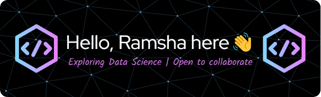

 

- 🌱 I’m currently learning **Neural Networks (Deep Learning)**
- 💬 Ask me about **Data Science**
- 📫 How to reach me **khanramsha302020@gmail.com**
- 📄 Know about my experiences [https://ramsha-resume.tiiny.site/](https://ramsha-resume.tiiny.site/)

<h3 align="left">Connect with me:</h3>

  

<h3 align="left">Languages and Tools:</h3>

  
  
  <!-- Add other icons here -->

&nbsp;

